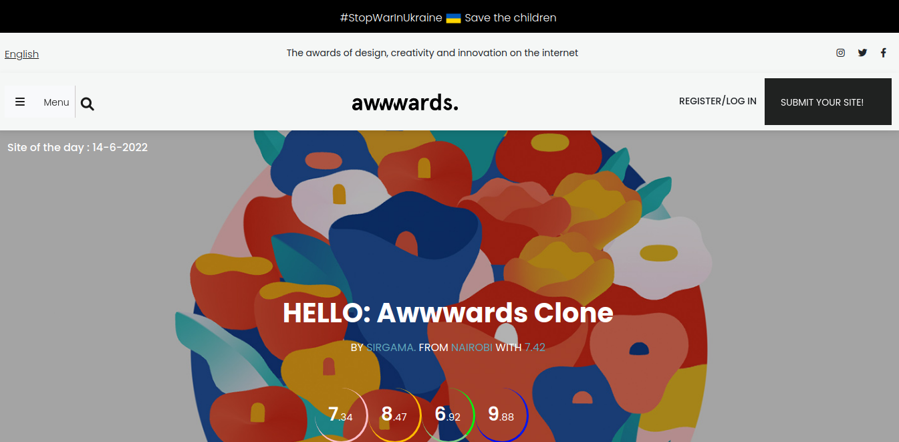
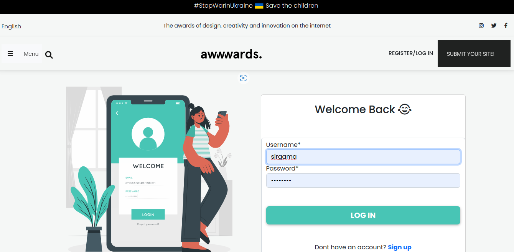
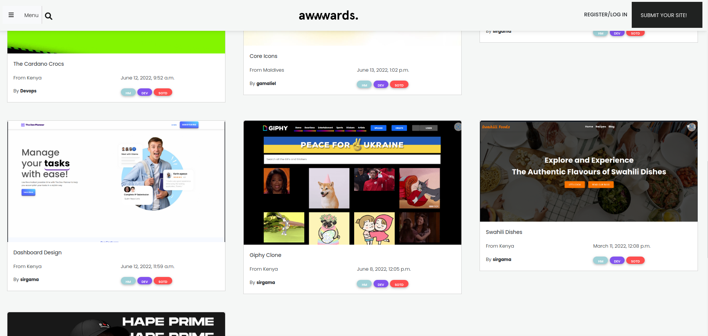

# Awwwards

## Project Description

This is a clone of the popular awwwards app  built using Python - Django.

- Users  can view listed projects.
- Users can login to rate on posted projects.
- Users can interact with the Api used to build the project through DRF.
- Users login to the platform and post projects to be rated.
<!-- 
## BDD

| Behavior            | Input                         | Output                        |
| ------------------- | ----------------------------- | ----------------------------- |
| View photos of interest | Scroll to see a gallery and click on picture | Displays a picture with name description and copy link for sharing |
| Search a picture by category | Enter the category in the search input| Displays Images in the searched category |
| View pictures by location | Click on location of interest from the Navbar | Displays Images of chosen location |
| Copy Link to clipboard | Click on copy link button in the modal class | Copies link to clipboard |
| View Single picture | Click on photo of interest then click on image | Displays a single page with details of the picture and related images | -->

 

## Getting Started

To clone the repository, run:

    git clone https://github.com/sirgama/awwwards

Then navigating to the cloned directory:

    cd awwwards

### Prerequisite
This awwwards Clone project requires a prerequisite understanding of the following:
- Django Framework
- Python3.9
- Postgres
- Python virtualenv

## Setup and installation

###  Activate virtual environment
Activate virtual environment using python3.9 as default handler
    `virtualenv -p /usr/bin/python3.9 genv && source genv/bin/activate`
####  Install dependancies
Install dependancies that will create an environment for the app to run `pip3 install -r requirements.txt`
####  Create the Database
    - psql
    - CREATE DATABASE awwards;
####  .env file
Create .env file and paste paste the following filling where appropriate:

    SECRET_KEY = '<Secret_key>'
    DBNAME = 'awwards'
    USER = '<Username>'
    PASSWORD = '<password>'
    DEBUG = True
#### Run initial Migration
    python3.9 manage.py makemigrations 
    python3.9 manage.py migrate
#### Run the app
    python3.9 manage.py runserver
    Open terminal on localhost:8000

## Deployment

The application is deployed on Heroku and is live on this link:

[https://awwards-ms.herokuapp.com/](https://awwards-ms.herokuapp.com/)

## Built With

  - [Django Rest Framework](https://www.django-rest-framework.org/) - Develop the API for communicating with the backend.
  - [Django 4.0.5](https://docs.djangoproject.com/en/4.0/releases/4.0.4/) - Back end logic of the application.
  - [Bootstrap](https://getbootstrap.com/) - Used for overall design and responsive site
  - [Cloudinary](https://cloudinary.com/console/c-11a54b72b392fb43204015047228ae/getting-started) - Used for image uploads.

## Contributing

Please read [CONTRIBUTING.md](CONTRIBUTING.md) for details on our code
of conduct, and the process for submitting pull requests to us.

## Author

  - **Gamaliel Sirengo** - *Full Stack Developer* -
    [Telegram](https://t.me/sirgama)

## License

MIT License

Copyright (c) 2022 Gamaliel Sirengo

Permission is hereby granted, free of charge, to any person obtaining a copy
of this software and associated documentation files (the "Software"), to deal
in the Software without restriction, including without limitation the rights
to use, copy, modify, merge, publish, distribute, sublicense, and/or sell
copies of the Software, and to permit persons to whom the Software is
furnished to do so, subject to the following conditions:

The above copyright notice and this permission notice shall be included in all
copies or substantial portions of the Software.

THE SOFTWARE IS PROVIDED "AS IS", WITHOUT WARRANTY OF ANY KIND, EXPRESS OR
IMPLIED, INCLUDING BUT NOT LIMITED TO THE WARRANTIES OF MERCHANTABILITY,
FITNESS FOR A PARTICULAR PURPOSE AND NONINFRINGEMENT. IN NO EVENT SHALL THE
AUTHORS OR COPYRIGHT HOLDERS BE LIABLE FOR ANY CLAIM, DAMAGES OR OTHER
LIABILITY, WHETHER IN AN ACTION OF CONTRACT, TORT OR OTHERWISE, ARISING FROM,
OUT OF OR IN CONNECTION WITH THE SOFTWARE OR THE USE OR OTHER DEALINGS IN THE
SOFTWARE.

